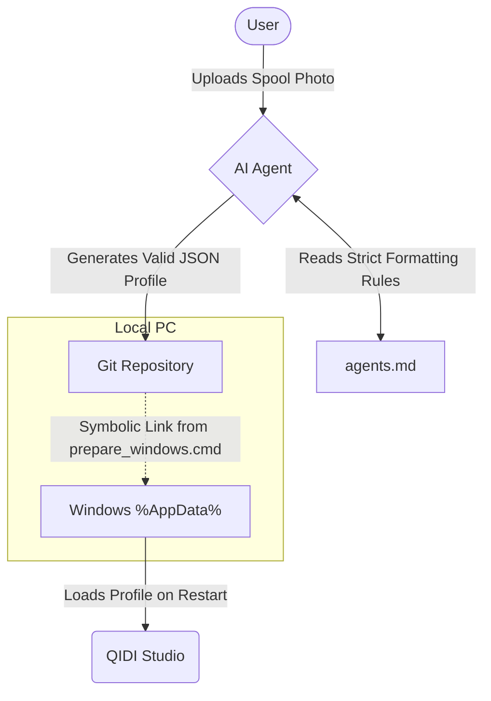

# QIDI Studio Automation & Version Control

This project is designed to bring **version control** and **AI-driven automation** to your [QIDI Studio](https://github.com/QIDITECH/QIDIStudio) (Orca Slicer-based) 3D printer profiles.

By default, QIDI Studio stores all custom user profiles deep inside the Windows AppData directory (`%AppData%\QIDIStudio\user\default`). This makes it difficult to back them up, share them, or update them programmatically. This project solves that by bridging your local slicer configuration directly to this Git repository.

## How It Works

The core of this project is the **`prepare_windows.cmd`** script. This script performs the initial environment setup:

1. **Backups:** It safely backs up any existing custom profiles you currently have in your AppData directory.
2. **Symbolic Linking:** It creates Windows Symbolic Links that map your `%AppData%\QIDIStudio\user\default` folders (`process`, `filament`, `machine`) directly to the corresponding folders in this Git repository.

### Why do this?

Once these symbolic links are established, your workflow becomes significantly more powerful:
* **Version Control:** Any tweaks or changes you make to your profiles within the QIDI Studio GUI are actually saved directly into this Git repository. You can run `git commit` and `push` to safely version-control your slicer settings.
* **Agentic Automation:** AI agents can directly generate or modify `.json` profile files in this repository. For example, if you upload a picture of a new filament spool's label, an agent can parse the recommended temperatures and parameters, and generate a new filament profile in the `filament/` directory. **When you restart QIDI Studio, it will instantly pick up the new AI-generated profile.**

### The Agentic Workflow

## Project Structure

* **`prepare_windows.cmd`**: The Windows batch script that links your AppData folder to this repository.
* **`prepare_windows.md`**: Detailed, step-by-step instructions on how to run the setup script safely and restore any backups.
* **`agents.md`**: A comprehensive instruction manual written specifically for AI agents. It details the strict JSON schemas, mandatory attributes, and specific naming conventions required to generate valid QIDI Studio profiles programmatically without corrupting the slicer.
* **`filament/`, `process/`, `machine/`**: The directories where your custom slicer JSON profiles are stored and version-controlled.

## Getting Started

To link your local QIDI Studio installation to this project:

1. Open `prepare_windows.cmd` and verify the `gitDir` variable points to the exact local path of this repository.
2. Right-click the script in Windows Explorer and select **Run as Administrator** (Admin rights are required by Windows to create symbolic links).
3. Follow the instructions in `prepare_windows.md` to migrate any of your old profiles into the newly linked folders.
4. Restart QIDI Studio. 

You are now ready to version-control your profiles and let AI agents generate new ones for you automatically!
