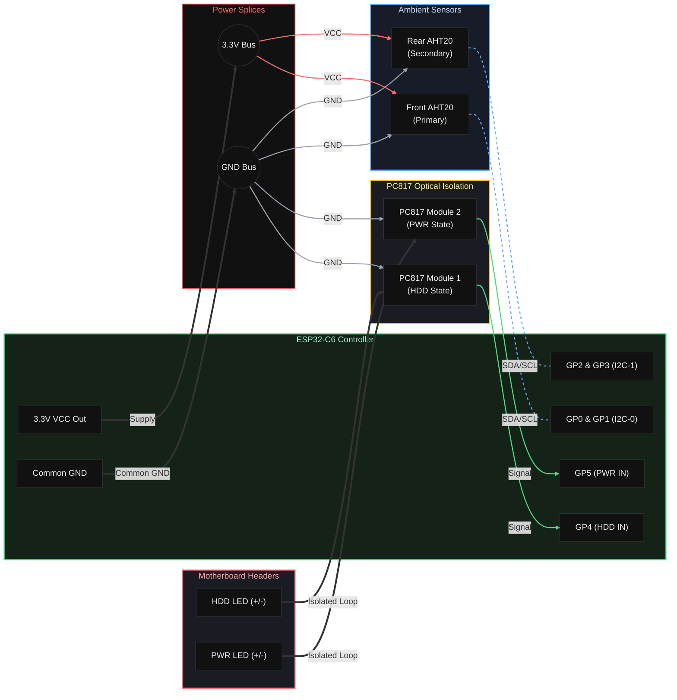

# Pip-Boy Telemetry Display for SFF Builds

## Why a Dedicated Front Panel Display?

In the Fallout universe, every Vault Dweller relies on their Pip-Boy — a wrist-mounted terminal that renders the invisible world legible: radiation counts, vital signs, inventory, the works. It is the single most trustworthy interface between the human and the hostile unknown.

This project brings that same philosophy to a Small Form Factor PC. Inside a compact chassis, temperatures climb fast, airflow is precious, and there is no room for complacency. A dedicated 1.47-inch IPS display, flush-mounted into the front panel, gives you an always-on, zero-click window into the health of your machine:

* **CPU & GPU thermals and load** — streamed in real-time from the host OS.
* **NVMe / SSD temperature** — critical in SFF builds where drives heat-soak quickly.
* **Fan RPM** — confirming your cooling is actually spinning.
* **HDD activity & Power state** — wired directly from the motherboard through optocouplers, bypassing all software latency for true hardware-level awareness.
* **Ambient temperature & humidity** — measured by on-board I2C sensors sitting inside the chassis.
* **Automatic day/night brightness** — the display dims itself after sunset and wakes before sunrise using geospatial solar calculations, so it never blinds you at night.

The entire UI follows a **RobCo / Pip-Boy terminal aesthetic** — green phosphor text on black, a Vault Boy boot logo, and chunky pixel-art status icons. It is equal parts functional monitoring tool and love letter to the Fallout art direction.

---

## 1. Compatible Hardware (Reference Bill of Materials)

This project is designed to be **open-ended**. The specific components listed below are a reference configuration — any hardware that meets the general specifications will work. Adapt freely to whatever you have on hand.

### 1.1. Telemetry Controller & Sensors (Required)

| Component | Reference Part | Spec / Notes |
| :--- | :--- | :--- |
| **Microcontroller + Display** | Waveshare ESP32-C6 1.47" IPS LCD | 172×320 resolution, ST7789/JD9853 driver. Any ESP32 board with an SPI LCD and USB-CDC support could be adapted. |
| **Ambient Sensor(s)** | Adafruit AHT20 (I2C) | Any I2C temperature/humidity sensor (SHT30, SHT40, BME280, etc.) will work with minor code changes. Up to 2 buses supported. |
| **Optical Isolation** | PC817 1-Channel Optocoupler Module × 2 | Used to read HDD LED and Power LED signals from the motherboard without galvanic coupling. Any single-channel optocoupler module works. **Ground isolation jumpers must be removed.** |

### 1.2. Host PC (Flexible)

| Component | Requirement |
| :--- | :--- |
| **Motherboard** | Any Mini-ITX (or other form factor) board with standard front-panel HDD LED and Power LED headers. |
| **CPU** | Any modern CPU. The host daemon reads sensor data via software — no specific CPU features are needed. |
| **GPU** | Any dedicated or integrated GPU. GPU temperature/load reporting requires a monitoring backend (see §4). |
| **OS** | Windows 10 / 11. The host daemon uses WMI and/or the LibreHardwareMonitor HTTP API. |
| **Internal USB Header** | One available USB 2.0 header for the ESP32-C6 connection (or an external USB-A/C port). |

> **Note:** The firmware and daemon are not locked to any specific CPU, GPU, or motherboard vendor. If your hardware monitoring software can report temperatures, loads, and fan speeds, this project will display them.

---

## 2. GPIO Pin Routing Matrix

| Component | Signal | ESP32-C6 GPIO | Source |
| :--- | :--- | :--- | :--- |
| **Ambient Sensor (Primary)** | I2C-0 SDA | GP0 | On-board sensor |
| **Ambient Sensor (Primary)** | I2C-0 SCL | GP1 | On-board sensor |
| **Ambient Sensor (Secondary)** | I2C-1 SDA | GP2 | On-board sensor |
| **Ambient Sensor (Secondary)** | I2C-1 SCL | GP3 | On-board sensor |
| **Optocoupler (HDD)** | Digital IN | GP4 | Motherboard: HDD LED (+/−) |
| **Optocoupler (PWR)** | Digital IN | GP5 | Motherboard: PWR LED (+/−) |

---

## 3. Hardware Interconnect Schematic



---

## 4. Host Daemon & Software Stack

| Layer | Technology | Notes |
| :--- | :--- | :--- |
| **Firmware** | C++ / PlatformIO / Arduino framework | Compiled in VSCode. Uses [LovyanGFX](https://github.com/lovyan03/LovyanGFX) for display driving. |
| **Host Daemon** | Python (`telemetry_stream.py`) | Queries hardware sensors and pushes serial payloads to the ESP32. |
| **Hardware Monitoring Backend** | [LibreHardwareMonitor](https://github.com/LibreHardwareMonitor/LibreHardwareMonitor) (recommended) | The daemon reads sensor data exclusively via the built-in HTTP JSON API (default port `8085`) to optimize performance and prevent host CPU overhead. WMI query fallback logic is removed. |
| **Geospatial Dimming** | Python `astral` library | Calculates local sunrise/sunset times and appends a brightness target to the serial payload so the display auto-dims at night. Configure your own coordinates in the script. |
| **Windows Service** | Scheduled Task (`SFF_Telemetry_Daemon`) | Runs silently at user logon with a 30-second boot delay to allow USB enumeration to complete. |

### 4.1. Serial Protocol & Hardware Quirks

* **CH343 Auto-Reset Trap:** The Waveshare ESP32-C6 uses a CH343 UART bridge where DTR/RTS are wired to EN and IO0. Asserting these lines resets the chip into Download Mode. The serial connection **must** be opened with `DTR=False` and `RTS=False`.
* **Buffer Sanitization & Overrun Protection:** The firmware flushes its input buffer on the `<` character and ignores `\r` / `\n` to prevent string corruption from mixed line endings. A loop guard (`!stringComplete`) stops reading from the serial FIFO when a complete packet is detected, preventing truncation or overwrites when multiple frames are pending.
* **Dynamic I2C Bus Hopping:** The ESP32-C6 features only one standard/regular hardware I2C controller. Since both temperature sensors share the same hardcoded I2C address (`0x38`), the firmware dynamically reroutes the pins of the single Wire peripheral (`GP0/GP1` for front, `GP2/GP3` for rear) during the execution loop to sample both devices sequentially.
* **Optocoupler Analog Threshold Reading:** Due to the PC817 optocoupler's Current Transfer Ratio (CTR) and low forward current from motherboard LED headers, the phototransistor's collector voltage remains above ~1V when active. This exceeds the digital logic-low threshold on ESP32-C6 GPIO pins. The status pins are read via `analogRead()` and evaluated against a software threshold (`ledThreshold = 3000`) to guarantee reliable state transition detection.
* **Graceful Offline State:** When serial data stops arriving for 8 seconds (configurable), the display gracefully transitions to a dim standby mode while continuing to render ambient sensor data — no reboot, no crash.

---

## 5. Building & Flashing

1. Install [PlatformIO](https://platformio.org/) in VSCode.
2. Open the `telemetry_display/` folder as a PlatformIO project.
3. Connect the ESP32-C6 via USB.
4. Click **Upload** (→) in the PlatformIO toolbar, or run:
   ```bash
   pio run --target upload
   ```
5. Configure and launch the host daemon — see `scripts/telemetry_stream.py`.