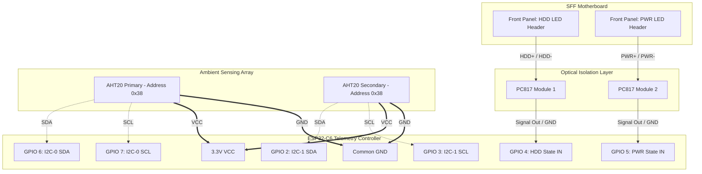

# Project: 9L SFF Telemetry & Compute Build
**Document:** Active Hardware & Architecture Manifest (`agents.md`)
**Author:** Aniva
**Date:** May 17, 2026

## 1. Core Compute Hardware Manifest
* **CPU:** Intel Core i5-14400 (LGA1700, 65W PL1 / 148W PL2, UHD Graphics 730 enabled for QSV)
* **Motherboard:** ASRock B760M-ITX/D4 (UEFI Version 11.02)
* **Cooler:** Thermalright AXP90-X47 FULL (100% Copper, 47mm Z-height, 4-heatpipe AGHP)
* **Memory:** 32GB (2x16GB) DDR4 3200MHz CL16 (Low-Profile specification strictly required; max 34mm Z-height)
* **Storage:** Samsung PM991 NVMe (Requires active thermal monitoring due to chassis heat soak)
* **GPU:** NVIDIA GTX 1650 SUPER (Dedicated to NVENC encoding/120Hz output)
* **Chassis:** Custom 9L Small Form Factor (Material: Polymaker PC-PBT)

## 2. Telemetry Subsystem Architecture
* **Microcontroller/Display:** Waveshare ESP32-C6 1.47" IPS LCD (CH343 UART Bridge)
* **Ambient Sensors:** 2x Adafruit AHT20 High-Precision Temperature & Humidity I2C Modules
* **Optical Isolation:** 2x PC817 1-Channel Optocoupler Modules (Ground isolation jumpers removed)

### 2.1. GPIO Pin Routing Matrix
| Component | Signal | ESP32-C6 GPIO | Motherboard Source |
| :--- | :--- | :--- | :--- |
| **AHT20 (Primary)** | I2C-0 SDA | GPIO 6 | N/A |
| **AHT20 (Primary)** | I2C-0 SCL | GPIO 7 | N/A |
| **AHT20 (Ambient)** | I2C-1 SDA | GPIO 2 | N/A |
| **AHT20 (Ambient)** | I2C-1 SCL | GPIO 3 | N/A |
| **PC817 (Opto 1)** | Digital IN | GPIO 4 | Front Panel: HDD LED (+/-) |
| **PC817 (Opto 2)** | Digital IN | GPIO 5 | Front Panel: PWR LED (+/-) |

### 2.2. Hardware Interconnect Schematic

## 3. Mandatory UEFI Parameters
* **IGPU Multi-Monitor:** `Enabled` (Mandatory for Intel Quick Sync Video / Insta360 Studio hardware acceleration)
* **Long Duration Power Limit (PL1):** `65W`
* **Short Duration Power Limit (PL2):** `148W` (Enabled via thermal capacity of AXP90-X47 FULL)

## 4. Host Daemon Operations
* **Target Script:** `SFF_Telemetry_Daemon.py`
* **Boot Delay:** `PT30S` (30-second delay task scheduler constraint to ensure complete USB enumeration).
* **Geospatial Dimming:** Integration via `astral` library (Locus: Mississauga, ON) for sunset/sunrise backlight scaling.
* **UART Trap:** Auto-reset bypass implemented via `serPort.dtr = False` and `serPort.rts = False`.